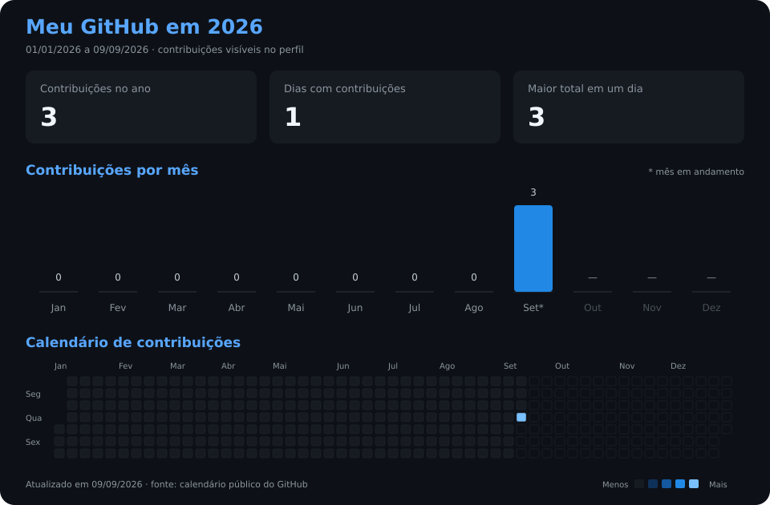

# Olá, eu sou o Evandro 👋

**Desenvolvedor Full Stack · PHP & Laravel · React & TypeScript**

Desenvolvimento web e mobile, com foco em back-end, APIs e integrações.

[GitHub](https://github.com/EvanAmorim18) · [LinkedIn](https://www.linkedin.com/in/evandro-amorim-96a52b205/)

---

### Sobre mim

Sou desenvolvedor de software com experiência na construção de aplicações web e mobile. Tenho preferência pelo back-end: gosto de organizar regras de negócio, estruturar APIs e conectar sistemas para resolver problemas do dia a dia.

Minha trajetória inclui sistemas de gestão, aplicações financeiras, integrações com serviços de pagamento e desenvolvimento de aplicativos. Trabalho principalmente com **PHP, Laravel, React e TypeScript**, acompanhando a construção de soluções do banco de dados à interface.

### Tecnologias

| Área | Tecnologias |
| --- | --- |
| Back-end | PHP, Laravel, Node.js, Fastify |
| Front-end | React, TypeScript, JavaScript, Tailwind CSS |
| Mobile | React Native, Expo |
| Banco de dados | PostgreSQL, MySQL, MariaDB, Redis |
| Ambiente de desenvolvimento | Git, Docker |
| Sites e e-commerce | WordPress, Elementor, WooCommerce |

### Meu GitHub neste ano

Do dia 1º de janeiro até a última atualização indicada no gráfico. Dados visíveis no meu perfil público do GitHub; atualização diária. As contribuições incluem as atividades contabilizadas pelo GitHub, não apenas commits.

<!-- Gráficos gerados por scripts/contributions.py e atualizados por .github/workflows/contributions.yml. O ano muda automaticamente em janeiro. -->

### O que você encontra no meu trabalho

- **APIs e integrações:** comunicação entre sistemas e serviços externos.
- **Aplicações web:** sistemas de gestão e interfaces conectadas ao back-end.
- **Desenvolvimento mobile:** aplicativos com React Native e Expo.
- **Organização de código:** separação de responsabilidades e atenção à manutenção.

### Interesses

Arquitetura de software, aplicações multi-tenant e uso de inteligência artificial em produtos e automações.

### Vamos conversar?

Gosto de trocar ideias sobre desenvolvimento, conhecer projetos e compartilhar experiências.

Você pode me encontrar no [LinkedIn](https://www.linkedin.com/in/evandro-amorim-96a52b205/).
